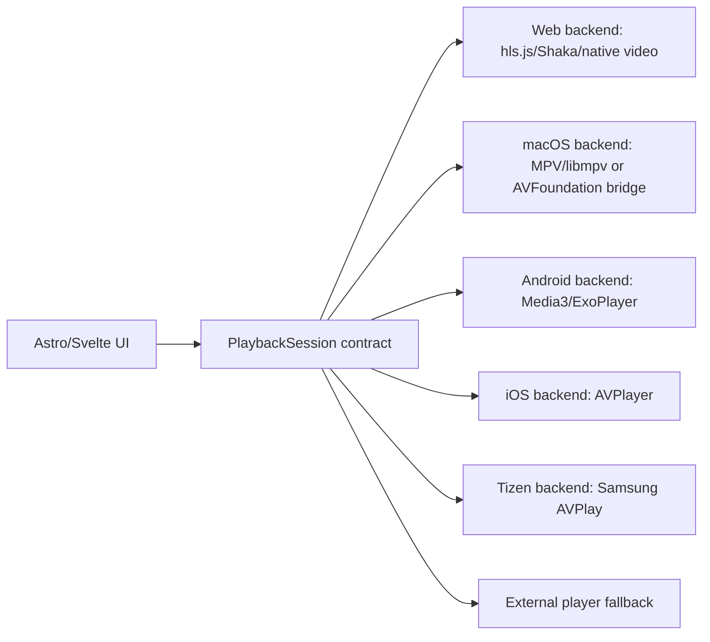

# Native playback rebuild strategy

This document is the reset point for future AI agents working on Leleg IPTV
native releases. It records what was learned from the current Leleg IPTV
implementation and from the external reference repository
`MaxMB15/MaxVideoPlayer`.

## Current conclusion

The web app is the only release that currently behaves consistently because it
uses the browser environment for the formats the browser can actually support:
HLS, MP4, some DASH/HLS variants, hls.js, Shaka, ArtPlayer, and browser text
tracks.

The non-web releases are unreliable because the project tried to make WebView
play every IPTV/VOD case directly or indirectly:

- macOS WKWebView does not reliably play Xtream VOD containers such as MKV.
- WKWebView and browser media APIs expose incomplete track control for many
  container formats.
- Remuxing MKV to MPEG-TS or generating local HLS through FFmpeg creates
  duration, seek, cache, and startup problems.
- External VLC/MPV launches solve codec support but break integrated UX:
  resume, in-app track selection, ended events, progress, fullscreen, and
  predictable error handling.
- iOS, Android, and Tizen each have different media stacks; a single web-player
  assumption cannot make every app release robust.

The product should not be rewritten completely. The catalog, provider, EPG,
settings, layout, localization, and web release are valuable. The playback layer
must become replaceable per platform.

## Reference: MaxVideoPlayer

Reference repository:

- GitHub: `https://github.com/MaxMB15/MaxVideoPlayer`
- README summary: Tauri v2 + React + Rust core + embedded `libmpv`.

MaxVideoPlayer's key architectural lesson is that the frontend is not the video
decoder. React renders UI and controls; `libmpv` performs playback in a native
surface.

Important reference paths in the cloned repo:

- `/private/tmp/MaxVideoPlayer/crates/core`
- `/private/tmp/MaxVideoPlayer/crates/tauri-plugin-mpv`
- `/private/tmp/MaxVideoPlayer/apps/desktop/src/hooks/useMpv.ts`
- `/private/tmp/MaxVideoPlayer/apps/desktop/src/components/player/VideoPlayer.tsx`
- `/private/tmp/MaxVideoPlayer/apps/desktop/src/lib/tauri.ts`

MaxVideoPlayer active platforms:

- macOS: embedded `libmpv` using `NSOpenGLView` plus OpenGL Core 3.2.
- Linux: embedded `libmpv` using EGL plus X11/Wayland surfaces.

MaxVideoPlayer planned/stub platforms:

- Windows: planned `libmpv`.
- Android/Fire Stick: planned/stub `libmpv`/SurfaceView path.
- iOS/iPadOS: planned/stub MPV/Metal comments.

Do not assume MaxVideoPlayer has production Android or iOS implementations. It
is useful mainly as a desktop-native playback architecture reference.

## MaxVideoPlayer patterns worth copying

### 1. Native player as a controlled backend

Max exposes commands through a Tauri plugin:

```ts
mpvLoad(url, startPos)
mpvPlay()
mpvPause()
mpvSeek(position)
mpvSetVolume(volume)
mpvGetState()
mpvSetBounds(x, y, w, h)
mpvSetVisible(visible)
mpvSubAdd(path)
mpvSubRemove(id)
mpvSetSubPos(pos)
mpvSetSubDelay(delay)
```

Leleg IPTV needs the same idea, but abstracted beyond MPV:

```ts
interface PlaybackSession {
  load(source, options)
  play()
  pause()
  stop()
  seek(seconds)
  setVolume(volume)
  selectAudioTrack(id)
  selectSubtitleTrack(id)
  setSubtitleDelay(seconds)
  getState()
  destroy()
}
```

The UI should not know whether the implementation is hls.js, Shaka, AVPlayer,
ExoPlayer, AVPlay, or MPV.

Current Leleg checkpoint:

- `src/scripts/lib/playback-session.ts` defines the first shared
  `PlaybackSession` contract and `mountPlaybackSession(...)` factory.
- `src/scripts/movies/detail.ts`, `src/scripts/series/detail.ts`, and
  `src/scripts/stream/stream.ts` now enter playback through that factory.
- The contract includes `getTracks()`, `selectAudioTrack(...)`,
  `selectSubtitleTrack(...)`, `setSubtitleDelay(...)`, `getState()`, and
  `on(...)`. The current web implementation derives track state from native
  media `audioTracks`/`textTracks` when the browser exposes them.
- `NativePlaybackSession` exists in the frontend and maps that same contract to
  Tauri commands. It is intentionally gated by `available && integrated`, so it
  will not replace the working web path until the Rust player is real.
- `NativePlaybackSession` now measures the video element bounds and calls
  `native_playback_attach`. This keeps native surface positioning behind the
  shared contract instead of scattering geometry logic in movie/series pages.
- It exposes a Video.js-shaped `handle` facade for compatibility with current
  page code. Future refactors can move pages to the pure `PlaybackSession`
  contract, but enabling native playback no longer requires every page to be
  converted in the same commit.
- `src-tauri/src/native_playback.rs` exposes `native_playback_status` for
  desktop diagnostics and contains the first MPV JSON IPC backend.
- When `mpv` is available, the Rust backend can spawn/control MPV and map the
  session lifecycle (`load`, `play`, `pause`, `stop`, `seek`, volume, audio
  track, subtitle track, subtitle delay, state) to MPV IPC commands.
- `native_playback_attach` validates the macOS Tauri native handles
  (`NSWindow*` and `NSView*`) and stores the frontend rectangle. This is a
  diagnostic surface bridge only; it does not render video yet.
- It still reports `integrated: false`: MPV is a controlled native engine, but
  its video output is not embedded in the Tauri window. Do not call macOS app
  playback production-ready, and do not flip `integrated: true`, until a real
  `libmpv` view renders a first frame in the Tauri window.
- Current macOS practical path: movies and series in Tauri auto-launch MPV for
  VOD playback, with `?embedded=1` as an escape hatch for testing the old
  WebView player. This is a working bridge, not the final integrated UX. Once
  `native_playback_status.integrated` becomes true, movie/series pages no
  longer auto-launch MPV before `mountPlaybackSession`.

Next agents should add native engines behind this contract, not by adding more
page-level special cases.

### 2. Native surface below transparent WebView

Max places native video underneath the Tauri WebView and keeps the web UI above
it as the control layer. On macOS this requires:

- transparent Tauri window/WebView
- native `NSOpenGLView` placed in the view hierarchy
- frontend reporting bounds with `getBoundingClientRect`
- native command `set_bounds`
- first-frame event so the frontend can hide black/loading overlays

This pattern is the realistic path for desktop native releases when embedded
browser playback is not enough.

### 3. Player state comes from the native engine

Max polls or receives state from MPV:

- `time-pos`
- `duration`
- `pause`
- `volume`
- current URL

Leleg must treat native player state as authoritative. Provider metadata can
remain a fallback for display, but the native backend should drive:

- current time
- duration
- buffering/loading state
- ended state
- error state
- selected tracks

### 4. Network recovery is native-aware

Max has a reconnect monitor that watches MPV events and properties. It detects
premature EOF by comparing `time-pos` and `duration`, then reissues `loadfile`
with `start=+position`.

This is much better than trying to infer all recovery from browser media events
or local FFmpeg proxy state.

### 5. Subtitles are explicit player operations

Max supports external subtitles through:

- OpenSubtitles search/download in Rust core.
- SRT parsing for overlay preview/editing.
- `mpv sub-add`.
- `sub-pos` and `sub-delay` native properties.

For Leleg, embedded subtitles must come from the backend's track list where
possible. External subtitle search/download can be a separate enhancement.

## Leleg current playback problem areas

Important current paths:

- `src/scripts/lib/player-runtime.ts`
- `src/scripts/lib/embedded-vod-playback.ts`
- `src/scripts/lib/embedded-hls-tracks.ts`
- `src/scripts/lib/embedded-shaka-tracks.ts`
- `src/scripts/lib/embedded-native-tracks.ts`
- `src/scripts/lib/embedded-vod-subtitles.ts`
- `src/scripts/lib/mpegts-provider-loader.js`
- `src/scripts/lib/mpegts-dev-proxy-loader.js`
- `src-tauri/src/media_proxy.rs`
- `src-tauri/src/external_player.rs`
- `src-tauri/gen/android/app/src/main/java/com/lelegiptv/player/MainActivity.kt`
- `packaging/tizen/config.xml`

The current stack contains too many competing playback paths:

- ArtPlayer
- native `<video>`
- hls.js
- Shaka
- dash.js
- mpegts.js
- local Rust media proxy
- FFmpeg remux endpoint `/__transcode`
- local VOD HLS endpoint `/__vod_hls`
- subtitle extraction endpoint `/__vod_subtitle`
- external MPV/VLC
- Android intent handoff

This is a symptom of the wrong abstraction boundary. These should become
backends behind one contract, not conditionals scattered across detail pages,
runtime helpers, proxy logic, and settings.

## Recommended target architecture

Keep Leleg IPTV as a web-first app with native player adapters.



### Shared contract events

Every backend should emit the same events:

- `player:ready`
- `player:first-frame`
- `player:loading`
- `player:buffering`
- `player:playing`
- `player:pause`
- `player:time`
- `player:duration`
- `player:ended`
- `player:error`
- `player:tracks`
- `player:track-change`

Every event payload should include:

- `backend`
- `sourceUrl`
- `position`
- `duration`
- `isLive`
- optional `errorCode`
- optional `errorMessage`

### Shared track model

```ts
interface PlaybackTrack {
  id: string
  kind: "audio" | "subtitle"
  label: string
  language?: string
  selected: boolean
  forced?: boolean
  codec?: string
  source?: "manifest" | "container" | "external"
}
```

## Platform strategy

### Web

Keep the current web path. It is the working release.

Use:

- Shaka for complex HLS/DASH where it exposes tracks better.
- hls.js where it is already stable for IPTV live.
- Native video for simple MP4/HLS where browser support is enough.

Do not use native-only adapters in the browser.

### macOS desktop

Best long-term path: Tauri shell plus native playback backend.

Candidate backends:

1. `libmpv` embedded, following MaxVideoPlayer.
2. AVFoundation/AVPlayer bridge.
3. External MPV/VLC as fallback only.

Recommendation:

- If priority is "plays almost everything", use `libmpv`.
- If priority is App Store-style Apple integration, evaluate AVPlayer, but MKV
  and codec coverage will be weaker than MPV.
- Stop relying on WKWebView for VOD containers.

The MaxVideoPlayer macOS implementation is the most relevant reference for:

- transparent WebView overlay
- `NSOpenGLView` insertion
- native bounds synchronization
- first-frame callback
- MPV duration/seek state
- fallback if renderer attach fails

### Linux desktop

Use the same MPV strategy as macOS. MaxVideoPlayer already has a Linux
reference using EGL plus X11/Wayland.

### Windows desktop

Either:

- implement MPV embedding for Windows, or
- keep WebView2 plus external MPV fallback until a Windows native backend is
  implemented.

Do not promise Windows VOD robustness until a native backend exists.

### Android and Android TV

Best path: Media3/ExoPlayer bridge.

Why:

- Android WebView is not a complete IPTV player.
- ExoPlayer/Media3 is the standard Android media stack.
- Android TV remote, PiP, audio focus, subtitles, and track selection are
  better handled natively.

Required native bridge responsibilities:

- create player view below or above WebView depending on overlay strategy
- load URL with headers/user-agent/referer where possible
- expose progress/duration/buffered/ended/error
- expose audio/subtitle tracks
- allow track selection
- support fullscreen and D-pad focus
- persist resume through shared frontend storage

The existing `MainActivity.kt` bridge is useful for:

- device detection
- fullscreen WebView patches
- PiP wrapper
- external app fallback

It is not a native integrated player yet.

### iOS and iPadOS

Best path: AVPlayer bridge.

Why:

- WKWebView media APIs are limited.
- iOS can play HLS well through AVFoundation.
- native AVPlayer can expose media selection groups for audio/subtitles where
  the stream/container supports them.

Limits:

- AVPlayer will not make every MKV/container magically work.
- If providers only expose MKV VOD, either server-side compatible sources,
  external conversion, or an MPV/VLC-like engine would be needed.
- App Store constraints may make bundling some codec stacks difficult.

### Samsung Tizen TV

Tizen is not a Tauri target.

Best path: Web App plus Samsung AVPlay adapter.

The current Tizen package is only:

- Astro static `dist`
- `build/tizen-web`
- `packaging/tizen/config.xml`
- signed `.wgt`

For robust TV playback, implement a Tizen backend using `webapis.avplay` when
available, with browser hls.js/Shaka fallback.

Required Tizen backend responsibilities:

- open stream URL
- set display rect
- prepare/play/pause/seek/stop
- receive buffering/current-time/duration/error events
- list/select tracks if supported by AVPlay APIs
- map Samsung remote keys to the same UI commands

## What to stop doing

Do not add more one-off workarounds inside `embedded-vod-playback.ts` or
`media_proxy.rs` without first deciding the backend contract.

Avoid these as primary strategies:

- guessing `.mp4` siblings from `.mkv`
- generating local HLS from remote MKV as the main app path
- using VLC fallback as the normal macOS user experience
- treating provider duration as actual media duration
- duplicating track menus from multiple helpers
- making iOS/macOS/Android/Tizen all follow the same WebView code path

These can remain as fallback or diagnostic tools, but they should not define
the product architecture.

## Migration plan

### Phase 0: freeze the working web path

- Keep the current web playback behavior as the stable baseline.
- Add regression tests around web source selection, HLS track extraction, Shaka
  track mapping, and resume state.
- Do not destabilize `/movies/detail`, `/series/detail`, and `/livetv` while
  native work starts.

### Phase 1: introduce the playback contract

- Create a `PlaybackSession` interface in `src/scripts/lib`.
- Move web playback behind a `WebPlaybackSession`.
- Keep current UI but remove direct backend-specific calls from detail pages.
- Add debug logging to show the selected backend and capability matrix.

### Phase 2: desktop native backend

- Decide between `libmpv` and AVPlayer for macOS.
- For "works with IPTV/VOD providers", prefer `libmpv`.
- Build a small prototype route/page first:
  - load URL
  - render video under WebView
  - play/pause/seek
  - read duration/time
  - list tracks
  - select audio/subtitle
- Only after the prototype works, wire it into movies/series/live.

### Phase 3: Android native backend

- Add Media3/ExoPlayer dependency.
- Implement Android player bridge with the same `PlaybackSession` event model.
- Test first on Android phone, then Android TV.
- Make ExoPlayer primary for Android VOD and Android TV.

### Phase 4: iOS backend

- Add AVPlayer bridge.
- Make AVPlayer primary for HLS/MP4 on iOS.
- Define a clear unsupported-container message for MKV when no compatible
  stream exists.

### Phase 5: Tizen backend

- Add a Tizen-only adapter around `webapis.avplay`.
- Keep Shaka/hls.js fallback.
- Test on real Samsung TV, not only browser preview.

## Documentation requirements for future work

Any new native playback backend must document:

- platform and minimum OS version
- supported stream types
- unsupported stream types
- how headers/user-agent/referer are applied
- how audio tracks are discovered and selected
- how subtitle tracks are discovered and selected
- how current time/duration are emitted
- how resume is stored/restored
- how errors are mapped
- how fullscreen/PiP/remote control works
- how to test on real hardware

## Verification matrix

For every backend, test at least:

- live HLS channel
- live MPEG-TS channel
- VOD MP4
- VOD MKV
- series episode
- multi-audio source
- subtitle source
- seek to middle
- resume after leaving route
- pause/play
- network interruption or provider stall
- fullscreen
- platform back button / remote back key

Do not mark a backend production-ready until this matrix passes on real device
hardware for that platform.
